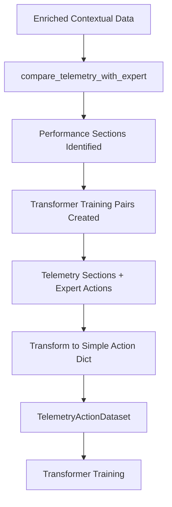

# Transformer Training Data Flow Correction

## Issue Identified

The original `compare_telemetry_with_expert` function return format was not compatible with the transformer model training expectations.

## Original Problem

**`compare_telemetry_with_expert` returned:**
```python
{
    'paired_data': [
        {
            'index': 0,
            'telemetry_data': {...},           # Single telemetry point
            'expert_actions': {...},           # Complex expert prediction object
            'similarity_score': 0.85
        }
    ],
    'performance_sections': [...]
}
```

**Transformer training expected:**
```python
[
    {
        'telemetry_section': [...],            # List of telemetry records
        'expert_actions': [...],               # List of action dictionaries
    }
]
```

## Solution Implemented

### 1. Modified `compare_telemetry_with_expert` Function

Added a new field `transformer_training_pairs` to the return value:

```python
{
    # ... existing fields ...
    'transformer_training_pairs': [
        {
            'telemetry_section': [...],        # List of telemetry records for the section
            'expert_actions': [...],           # List of expert action predictions for the section
            'pattern': 'increasing',           # Section pattern (increasing/decreasing/high_performance)
            'section_stats': {...}             # Section statistics
        }
    ]
}
```

### 2. Updated Transformer Training Method

Modified `_train_expert_action_transformer` to:

1. **Extract training pairs correctly:**
   ```python
   comparison_results = imitation_learning.compare_telemetry_with_expert(enriched_contextual_data, 5, 5)
   training_and_expert_action = comparison_results.get('transformer_training_pairs', [])
   ```

2. **Process expert actions properly:**
   - Extract `optimal_actions` from complex expert prediction objects
   - Convert to simple action dictionaries with `Physics_steer_angle`, `Physics_gas`, `Physics_brake`
   - Handle cases where actions are already in the right format

### 3. Data Flow Now Correct



## Key Changes Made

### In `imitate_expert_learning_service.py`

1. **Added transformer training pairs generation:**
   ```python
   # Process performance sections and create training pairs for transformer
   transformer_training_pairs = []
   
   for section in sections:
       # ... extract section data ...
       transformer_pair = {
           'telemetry_section': telemetry_section,
           'expert_actions': expert_actions_section,
           'pattern': section['pattern'],
           'section_stats': {...}
       }
       transformer_training_pairs.append(transformer_pair)
   
   result['transformer_training_pairs'] = transformer_training_pairs
   ```

### In `full_dataset_ml_service.py`

1. **Updated data extraction:**
   ```python
   comparison_results = imitation_learning.compare_telemetry_with_expert(enriched_contextual_data, 5, 5)
   training_and_expert_action = comparison_results.get('transformer_training_pairs', [])
   ```

2. **Enhanced expert action processing:**
   ```python
   for expert_action in expert_action_section:
       if isinstance(expert_action, dict):
           optimal_actions = expert_action.get('optimal_actions', {})
           action_dict = {
               'Physics_steer_angle': optimal_actions.get('optimal_steering', 0.0),
               'Physics_gas': optimal_actions.get('optimal_throttle', 0.0),
               'Physics_brake': optimal_actions.get('optimal_brake', 0.0)
           }
           expert_actions.append(action_dict)
   ```

## Benefits of This Correction

1. **Correct Data Format**: Transformer now receives properly formatted training pairs
2. **Section-Based Learning**: Training focuses on performance sections (rising/peak/falling scores)
3. **Action Extraction**: Expert actions are properly extracted from complex prediction objects
4. **Better Training Data**: Sections provide meaningful sequences for transformer learning
5. **Performance Context**: Each training pair includes section statistics and patterns

## Usage Example

```python
# This will now work correctly
async def transformerLearning(self, trackName: str):
    # ... data preparation ...
    
    # Compare with expert and get transformer training pairs
    comparison_results = imitation_learning.compare_telemetry_with_expert(enriched_contextual_data, 5, 5)
    training_pairs = comparison_results.get('transformer_training_pairs', [])
    
    # Each training pair now has the correct format:
    # {
    #     'telemetry_section': [list of telemetry dicts],
    #     'expert_actions': [list of expert action predictions],
    #     'pattern': 'increasing'/'decreasing'/'high_performance',
    #     'section_stats': {...}
    # }
    
    # Train transformer with correctly formatted data
    transformer_results = await self._train_expert_action_transformer(
        training_and_expert_action=training_pairs,
        trackName=trackName
    )
```

The transformer model can now correctly learn to predict expert action sequences from telemetry data, focusing on sections where performance is changing (rising, falling, or consistently high).
